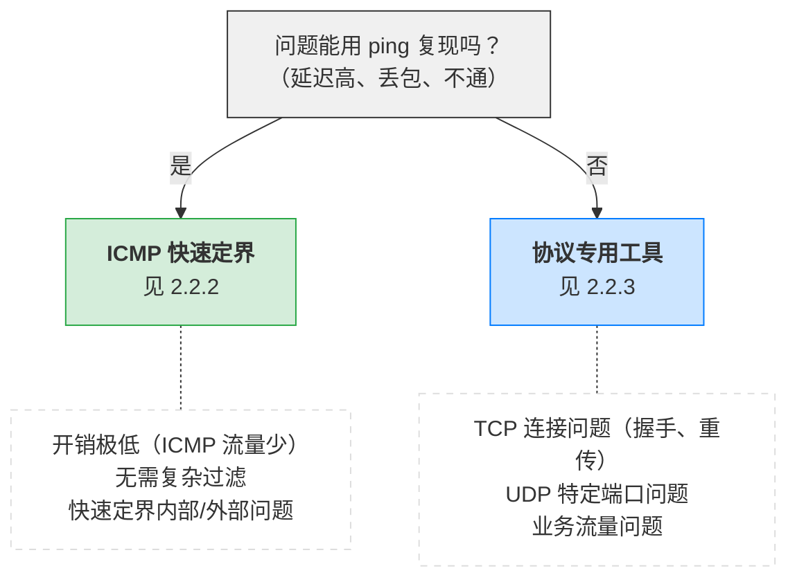
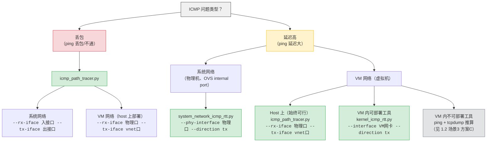
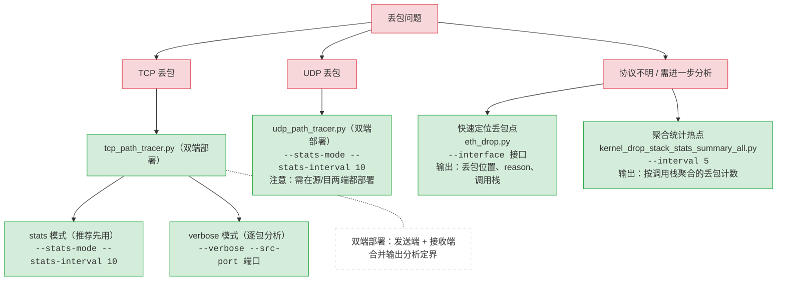
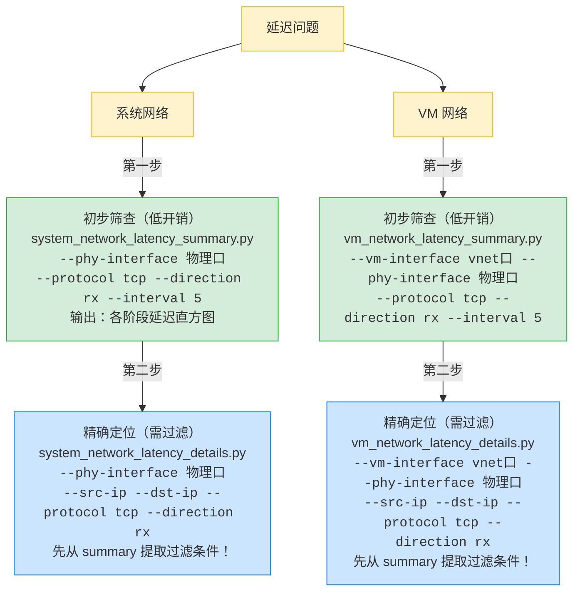

# 网络测量工具培训文档

本文档面向一线售后团队，帮助快速掌握网络问题定界和测量工具的使用方法。 文档 && repo 详情见附录 J 。

---

## 文档结构

| 章节                     | 内容                                     |
| ------------------------ | ---------------------------------------- |
| 第1章 快速入门           | 两阶段排查方法、定界场景                 |
| 第2章 工具选择指南       | **核心章节**：性能开销、完整决策树 |
| 第3章 核心工具详解       | 各类工具的详细使用方法                   |
| 第4章 扩展能力预览       | 工具发布状态、数据路径覆盖               |
| 第5章 常见问题与输出解读 | FAQ、输出解读、调试技巧                  |
| 附录 命令速查表          | 快速参考                                 |

---

## 快速导航

### 按问题类型

| 问题                | 推荐章节                  |
| ------------------- | ------------------------- |
| 网络丢包（ICMP）    | 1.2 场景1、2.2.2 ICMP定界 |
| 网络丢包（TCP/UDP） | 2.2.3 协议专用、3.1.2     |
| 系统网络延迟        | 1.2 场景2、3.2.1          |
| VM 网络延迟         | 1.2 场景3、3.2.2          |
| OVS 问题            | 3.6 OVS 工具              |
| 虚拟化网络问题      | 3.8 KVM 虚拟化            |
| TCP 性能问题        | 3.10 TCP 性能             |
| 工具无输出          | 5.1 Q1                    |
| 看不懂输出          | 5.2 输出解读              |

### 按使用阶段

| 阶段     | 推荐内容       |
| -------- | -------------- |
| 初次使用 | 第1章 → 第2章 |
| 日常使用 | 附录命令速查表 |
| 遇到问题 | 第5章 FAQ      |
| 需要深入 | 第3章工具详解  |

---

## 核心方法论

### 两阶段排查

> **阶段一：定界** — 确定问题在内部还是外部
>
> 使用 path_tracer 和 *_icmp_rtt 系列工具，开销低，快速定位问题区段。

> **阶段二：详情** — 深入分析内部问题
>
> 使用 *_latency_summary/details 和 eth_drop 等系列工具，提供逐包/逐阶段详细数据。

### 性能开销

> **开销取决于过滤后事件速率，不是原始流量大小。**
>
> 配合严格过滤（延迟阈值、五元组），Details 工具也可以安全运行。
> 详见 2.1 性能开销模型

### 分层策略

> **先 Summary，后 Details！**
>
> 延迟问题先用 Summary 工具识别异常，提取过滤条件后再用 Details 精确定位。

---

## 工具命名说明

| 名称模式                     | 含义                 |
| ---------------------------- | -------------------- |
| `*_path_tracer.py`         | 路径跟踪器，用于定界 |
| `*_icmp_rtt.py`            | ICMP RTT 测量        |
| `*_latency_summary.py`     | 延迟统计（直方图）   |
| `*_latency_details.py`     | 延迟详情（逐包）     |
| `*_drop*.py`               | 丢包检测             |
| `*_performance_metrics.py` | 综合性能指标         |

---

## 版本信息

- 适用工具版本：everoute/troubleshooting-tools（已发布）+  echkenluo/troubleshooting-tools（可用但未全平台测量与发布）

---

## 反馈与支持

如有问题或建议，请联系开发团队。

---

# 第1章 快速入门

本章帮助你在 5 分钟内掌握最常用的网络问题排查方法。

## 1.1 两阶段排查方法论

网络问题排查分为两个阶段：

```
阶段一：定界（确定问题范围）
    │
    │ 目标：确定问题发生在哪个区段
    │ 工具：path_tracer 系列、*_icmp_rtt 系列
    │ 特点：开销低，可快速执行
    │
    ↓
阶段二：详情（深入分析）
    │
    │ 前提：定界完成，问题在本机/内部
    │ 工具：*_latency_summary/details、eth_drop、kernel_drop_*
    │ 特点：提供逐包/逐阶段详细数据
```

**一线售后的核心工作在阶段一**：通过定界工具确定问题在内部还是外部，收集证据后上报开发团队。阶段二工具在开发团队指导下按需使用。

---

## 1.2 定界场景

### 场景1：丢包定界（ICMP）

**问题**：ping 对端丢包或不通，需要确定丢在哪一段。

**工具**：`icmp_path_tracer.py` — 在本机的两个接口（入口/出口）上跟踪 ICMP 包，将路径分为三段：入口→出口（内部转发）、出口→外部→出口（外部往返）、出口→入口（内部回复）。

```bash
sudo python icmp_path_tracer.py \
    --src-ip 10.0.0.1 --dst-ip 10.0.0.2 \
    --rx-iface ens4f0 --tx-iface vnet0
```

**输出解读**：

```
[14:32:15.123] ICMP id=1234 seq=1
  [0] REQ_RX  ens4f0   ts=1234567890
  [1] REQ_TX  vnet0    ts=1234567920  (+30us)
  [2] REP_RX  vnet0    ts=1234568100  (+180us)
  [3] REP_TX  ens4f0   ts=1234568130  (+30us)
  STATUS: COMPLETE

[14:32:16.125] ICMP id=1234 seq=2
  [0] REQ_RX  ens4f0   ts=1234667890
  [1] REQ_TX  vnet0    ts=1234667920  (+30us)
  STATUS: EXTERNAL_DROP (missing REP_RX after 1000ms)
```

| 状态                  | 含义                 | 下一步                     |
| --------------------- | -------------------- | -------------------------- |
| `COMPLETE`          | 包正常通过           | 无问题                     |
| `INTERNAL_DROP_REQ` | 请求包在本机内部丢失 | 检查本机转发配置、OVS 规则 |
| `EXTERNAL_DROP`     | 包已发出但无回复     | 检查网络、对端             |
| `INTERNAL_DROP_REP` | 回复包在本机内部丢失 | 检查本机回复路径           |

**其他协议丢包定界**：TCP/UDP 丢包使用 `tcp_path_tracer.py` / `udp_path_tracer.py`，原理相同但需要在通信双方的宿主机上分别部署，合并两端输出确定丢包段（详见第2章）。

---

### 场景2：延迟定界 — 系统网络

**问题**：系统网络（物理机、OVS internal port）延迟高，需要定位延迟在哪个阶段。

**工具**：`system_network_icmp_rtt.py` — 专用于系统网络的 ICMP RTT 分段测量，覆盖 OVS 路径。

```bash
sudo python system_network_icmp_rtt.py \
    --src-ip 10.132.114.11 --dst-ip 10.132.114.12 \
    --phy-interface ens11 --direction tx
```

**输出解读**：

```
=== System Network ICMP RTT Tracer ===
Direction: TX (local ping remote)
Filter: 10.132.114.11 -> 10.132.114.12

[14:35:22.456] seq=1 TOTAL_RTT=245us
  TX: ip_local_out -> netif_receive_skb: 45us
      netif_receive_skb -> ip_rcv: 12us
      ip_rcv -> net_dev_xmit: 28us
  RX: netif_receive_skb -> icmp_rcv: 35us
  WIRE_TIME: 125us

[14:35:23.458] seq=2 TOTAL_RTT=1523us  <<<< ABNORMAL
  TX: ip_local_out -> netif_receive_skb: 42us
      netif_receive_skb -> ip_rcv: 1105us  <<<< BOTTLENECK
      ip_rcv -> net_dev_xmit: 31us
  ...
```

**关注点**：

- `TOTAL_RTT`：总往返时间
- 各阶段时间：定位瓶颈在哪一段
- `WIRE_TIME`：网络传输时间（排除本机处理）

---

### 场景3：延迟定界 — VM 网络

**问题**：虚拟机网络延迟高，需要定位是虚拟化层、物理网络还是对端问题。

VM 网络延迟定界比系统网络复杂，因为涉及 host 侧和 VM 侧两个测量位置。

#### 方案A：Host 上部署（推荐，始终可行）

Host 上使用 `icmp_path_tracer.py` 在物理口和 vnet 口上跟踪，将路径分为 host 内部处理和外部往返两段：

```bash
# host 上运行，覆盖物理口到 vnet 口的完整路径
sudo python icmp_path_tracer.py \
    --src-ip 172.21.153.113 --dst-ip 172.21.153.114 \
    --rx-iface ens4f0 --tx-iface vnet0
```

**定界逻辑**：

- `REQ_RX → REQ_TX` 延迟大：host 内部转发（OVS/虚拟化层）瓶颈
- `REQ_TX → REP_RX` 延迟大：外部（VM 内部处理 + 网络 + 对端）瓶颈
- `REP_RX → REP_TX` 延迟大：host 内部回复路径瓶颈

#### 方案B：VM 内可部署工具

如果 VM 内可以部署 BCC 工具，用 `kernel_icmp_rtt.py` 测量 VM 内核各阶段延迟：

```bash
# VM 内运行
sudo python kernel_icmp_rtt.py \
    --src-ip 172.21.153.113 --dst-ip 172.21.153.114 \
    --interface eth0 --direction tx
```

**组合分析**：host 上 path_tracer 确定 host 内部 vs 外部，VM 内 kernel_icmp_rtt 确定 VM 内核处理 vs 网络传输。

#### 方案C：VM 内无法部署工具

当 VM 内不方便部署 BCC 工具时，可通过 ping + tcpdump 推算 VM 内延迟：

```bash
# VM 内同时执行：
# 1. ping 生成流量并记录应用感知延迟
ping -i 1 172.21.153.114

# 2. tcpdump 在 VM 网卡上抓取 ICMP request 和 reply
sudo tcpdump -i eth0 -nn icmp -w /tmp/icmp.pcap
```

**推算方法**：

- **应用感知 RTT**：ping 输出的 `time=` 值（从发送 request 到收到 reply 的完整用户态 RTT）
- **外部处理延迟**：tcpdump 中同一 seq 的 request 发出时间到 reply 到达时间的差值（网卡层面的 RTT，排除了 VM 内核协议栈处理）
- **VM 内核处理延迟**：应用感知 RTT − 外部处理延迟（粗略估算）

这些推算值与 `kernel_icmp_rtt` 的直接测量值含义类似，只是精度较低。

---

## 1.3 定界后的详细分析

定界完成后，如果问题在本机/内部，需要使用详情工具进一步分析。

### 丢包详情分析

| 工具                                       | 功能                                   | 适用场景         |
| ------------------------------------------ | -------------------------------------- | ---------------- |
| `eth_drop.py`                            | 通用丢包检测，输出丢包位置和内核调用栈 | 定位具体丢包函数 |
| `kernel_drop_stack_stats_summary_all.py` | 按调用栈聚合丢包统计                   | 识别丢包热点路径 |

```bash
# 快速检测丢包位置
sudo python eth_drop.py --src-ip 10.0.0.1 --dst-ip 10.0.0.2

# 按调用栈聚合统计
sudo python kernel_drop_stack_stats_summary_all.py --interval 5
```

### 延迟详情分析

| 网络类型 | Summary 工具（低开销）                | Details 工具（需过滤）                |
| -------- | ------------------------------------- | ------------------------------------- |
| 系统网络 | `system_network_latency_summary.py` | `system_network_latency_details.py` |
| VM 网络  | `vm_network_latency_summary.py`     | `vm_network_latency_details.py`     |

**分层策略**：先用 Summary 识别异常阶段和时段，再用 Details 配合过滤条件精确定位（详见第2章 2.3 节）。

---

## 1.4 快速选择指南

```
我遇到了什么问题？
    │
    ├── 丢包/不通
    │   ├── ICMP（ping）→ icmp_path_tracer.py
    │   ├── TCP → tcp_path_tracer.py（双端部署）
    │   └── UDP → udp_path_tracer.py（双端部署）
    │
    ├── 延迟高
    │   ├── 系统网络 → system_network_icmp_rtt.py
    │   └── VM 网络
    │       ├── Host 上 → icmp_path_tracer.py（始终可行）
    │       ├── VM 内可部署 → kernel_icmp_rtt.py
    │       └── VM 内不可部署 → ping + tcpdump 推算
    │
    ├── 定界完成，需深入分析
    │   ├── 丢包详情 → eth_drop.py / kernel_drop_*
    │   └── 延迟详情 → *_latency_summary.py → *_latency_details.py
    │
    └── 不确定 → 先用 icmp_path_tracer.py 看整体情况
```

---

## 1.5 下一步

- 问题无法用 ICMP 复现？→ 第2章 工具选择指南
- 需要深入了解某个工具？→ 第3章 核心工具详解
- 看不懂输出？→ 第5章 常见问题与输出解读

---

# 第2章 工具选择指南

本章是培训的核心章节，帮助你：

1. 理解工具的性能开销，避免影响生产环境
2. 根据问题类型选择正确的工具
3. 掌握完整的问题定界流程

---

## 2.1 性能开销模型

### 2.1.1 核心原则

工具的实际开销取决于 **通过过滤条件提交到 userspace 的事件数量**，而非原始流量大小。

- **Summary 类工具**：在内核态聚合（直方图），仅定期输出统计结果，无论流量多大开销都很低
- **Path Tracer 类工具**（stats 模式）：在 BPF 侧聚合统计，仅输出周期性 summary，开销被严格控制
- **Path Tracer 类工具**（verbose 模式）：逐包输出完整事件，开销取决于匹配流量
- **Details 类工具**：逐包输出完整元数据，开销取决于通过过滤的事件数量

**关键理解**：即使原始流量很大，只要过滤条件严格（如延迟阈值过滤、五元组过滤），实际提交到 userspace 的事件可以很少，开销就很低。反之，宽松的过滤加上大流量会导致高开销。

### 2.1.2 工具开销分级表

| 开销           | 工具                                       | 说明                           |
| -------------- | ------------------------------------------ | ------------------------------ |
| **低**   | `icmp_path_tracer.py`                    | ICMP 流量通常 < 100 PPS        |
| **低**   | `kernel_icmp_rtt.py`                     | 同上                           |
| **低**   | `system_network_icmp_rtt.py`             | 同上                           |
| **低**   | `*_latency_summary.py`                   | 内核态直方图聚合               |
| **低**   | `eth_drop.py`                            | 仅跟踪丢包事件                 |
| **低**   | `kernel_drop_stack_stats_summary_all.py` | 按调用栈聚合                   |
| **低**   | `tcp_path_tracer.py`（stats 模式）       | BPF 侧聚合，周期性输出         |
| **低**   | `udp_path_tracer.py`（stats 模式）       | BPF 侧聚合，周期性输出         |
| **可变** | `tcp_path_tracer.py`（verbose 模式）     | 取决于匹配流量，需指定 IP 过滤 |
| **可变** | `udp_path_tracer.py`（verbose 模式）     | 取决于匹配流量，需指定 IP 过滤 |
| **可变** | `*_latency_details.py`                   | 取决于通过过滤的事件数         |
| **可变** | `vhost_queue_correlation_details.py`     | 取决于 VM 数量和流量           |

### 2.1.3 tcp/udp_path_tracer 双模式说明

`tcp_path_tracer.py` 和 `udp_path_tracer.py` 支持两种互斥模式：

| 模式                   | 参数             | 输出内容                                                                        | 开销                   |
| ---------------------- | ---------------- | ------------------------------------------------------------------------------- | ---------------------- |
| **Stats 模式**   | `--stats-mode` | 周期性 summary：延迟统计（avg/min/max/P50/P99）、路径首尾包匹配情况、内部丢包数 | 低（BPF 侧聚合）       |
| **Verbose 模式** | `--verbose`    | 逐包完整事件：每个包的四阶段时间戳和状态                                        | 可变（取决于匹配流量） |

**推荐**：优先使用 stats 模式进行定界，仅在需要逐包分析时切换到 verbose 模式。

```bash
# Stats 模式（低开销，适合长期运行）
sudo python tcp_path_tracer.py \
    --src-ip 10.0.0.1 --dst-ip 10.0.0.2 \
    --rx-iface ens4f0 --tx-iface vnet0 \
    --stats-mode --stats-interval 10

# Verbose 模式（逐包输出）
sudo python tcp_path_tracer.py \
    --src-ip 10.0.0.1 --dst-ip 10.0.0.2 \
    --rx-iface ens4f0 --tx-iface vnet0 \
    --verbose --src-port 5201
```

### 2.1.4 高开销场景安全指南

> **核心原则**：确保通过过滤提交到 userspace 的事件速率可控。

#### 降低事件速率的方法

| 方法         | 说明                                   | 示例                 |
| ------------ | -------------------------------------- | -------------------- |
| 五元组过滤   | 指定 src-ip + dst-ip + protocol + port | 缩小匹配范围         |
| 延迟阈值过滤 | 使用 `--latency-ms` 仅输出高延迟事件 | 绝大部分正常包被过滤 |
| 端口过滤     | 指定 `--src-port` / `--dst-port`   | 限定到特定连接       |

#### 使用 Details 工具前评估

```bash
# 估算过滤后的事件速率
timeout 10 tcpdump -i eth0 host 10.0.0.1 and host 10.0.0.2 -c 1000 2>&1 | tail -1
# "1000 packets captured" in 5 seconds → ~200 PPS

# 如果 PPS 较高，使用更严格的过滤：
# 1. 添加端口过滤
# 2. 使用延迟阈值过滤（--latency-ms）
# 3. 改用 Summary 工具
```

#### 过滤条件要求

| 过滤参数       | Details 工具   | Path Tracer 工具   |
| -------------- | -------------- | ------------------ |
| `--src-ip`   | **必须** | **必须**     |
| `--dst-ip`   | **必须** | **必须**     |
| `--protocol` | 建议           | 不适用（协议特定） |
| `--port`     | 建议（如支持） | 建议（如支持）     |

#### 正确 vs 错误用法示例

```bash
# 错误：无过滤条件，事件量不可控
sudo python vm_network_latency_details.py --vm-interface vnet0

# 错误：只有单向 IP，事件量可能仍然很大
sudo python vm_network_latency_details.py --vm-interface vnet0 --src-ip 10.0.0.1

# 正确：完整过滤条件
sudo python vm_network_latency_details.py --vm-interface vnet0 \
    --src-ip 10.0.0.1 --dst-ip 10.0.0.2 --protocol tcp

# 正确：配合延迟阈值，仅关注高延迟包，可长期运行
sudo python system_network_latency_details.py \
    --phy-interface ens11 \
    --src-ip 10.0.0.1 --dst-ip 10.0.0.2 --protocol tcp \
    --latency-ms 10
```

---

## 2.2 完整工具选择决策树

### 2.2.1 第一步：问题能否用 ICMP 复现？



### 2.2.2 ICMP 快速定界路径（推荐）



### 2.2.3 协议专用工具路径

#### 丢包问题



#### 延迟问题



---

## 2.3 Summary → Details 分层策略

### 2.3.1 为什么要分层？

| 阶段     | 工具类型 | 开销 | 目标               |
| -------- | -------- | ---- | ------------------ |
| 第一阶段 | Summary  | 低   | 发现异常，缩小范围 |
| 第二阶段 | Details  | 可变 | 精确定位，找到根因 |
| 第三阶段 | Summary  | 低   | 验证修复，持续监控 |

### 2.3.2 标准流程

```
第一步：Summary 工具建立基线
    │
    │ 开销：低，可长时间运行
    │ 命令：*_latency_summary.py --interval 5
    │
    │ 目标输出：
    │ - 哪个阶段延迟异常？
    │ - 哪个时间段异常？
    │ - 哪些 IP 对异常？
    ↓
第二步：提取过滤条件
    │
    │ 从 Summary 输出中获取：
    │ - 异常源 IP：--src-ip
    │ - 异常目的 IP：--dst-ip
    │ - 异常协议：--protocol
    │ - 异常端口：--port（如有）
    │ - 延迟阈值：--latency-ms（如支持）
    ↓
第三步：Details 工具精确定位
    │
    │ 开销：取决于过滤后事件速率
    │ 命令：*_latency_details.py + 上述过滤条件
    │
    │ 目标输出：
    │ - 具体哪个包延迟高？
    │ - 延迟发生在哪个函数？
    │ - 调用栈是什么？
    ↓
第四步：修复后验证
    │
    │ 回到 Summary 工具持续监控
    │ 确认问题不再复现
```

### 2.3.3 实战示例

```bash
# 阶段1：Summary 发现问题
sudo python vm_network_latency_summary.py \
    --vm-interface vnet0 --phy-interface ens4f0 \
    --protocol tcp --direction rx --interval 5

# 输出发现：
# - OVS_RX 阶段 P99 延迟异常（> 1ms）
# - 主要来自 172.21.153.113 -> 172.21.153.114

# 阶段2：提取过滤条件
# src-ip: 172.21.153.113
# dst-ip: 172.21.153.114
# protocol: tcp

# 阶段3：Details 精确定位
sudo python vm_network_latency_details.py \
    --vm-interface vnet0 --phy-interface ens4f0 \
    --src-ip 172.21.153.113 --dst-ip 172.21.153.114 \
    --protocol tcp --direction rx

# 输出：逐包延迟详情，定位到具体瓶颈函数

# 阶段4：修复后验证
sudo python vm_network_latency_summary.py \
    --vm-interface vnet0 --phy-interface ens4f0 \
    --src-ip 172.21.153.113 --dst-ip 172.21.153.114 \
    --protocol tcp --direction rx --interval 10
```

---

## 2.4 工具速查表

### 2.4.1 按问题类型

| 问题                  | 定界工具（阶段一）                               | 详情工具（阶段二）                                            |
| --------------------- | ------------------------------------------------ | ------------------------------------------------------------- |
| ICMP 丢包             | `icmp_path_tracer.py`                          | `eth_drop.py`、`kernel_drop_*`                            |
| ICMP 延迟（系统网络） | `system_network_icmp_rtt.py`                   | `system_network_latency_summary/details.py`                 |
| ICMP 延迟（VM 网络）  | `icmp_path_tracer.py` + `kernel_icmp_rtt.py` | `vm_network_latency_summary/details.py`                     |
| TCP 丢包              | `tcp_path_tracer.py`（stats 模式）             | `eth_drop.py `/ `kernel_drop_stack_stats_summary_all.py` |
| UDP 丢包              | `udp_path_tracer.py`（stats 模式）             | `eth_drop.py `/ `kernel_drop_stack_stats_summary_all.py` |
| 协议不明丢包          | `eth_drop.py`                                  | `kernel_drop_stack_stats_summary_all.py`                    |
| 系统网络延迟          | `system_network_latency_summary.py`            | `system_network_latency_details.py`                         |
| VM 网络延迟           | `vm_network_latency_summary.py`                | `vm_network_latency_details.py`                             |

### 2.4.2 按网络类型

| 网络类型 | 丢包定界（多点部署）    | 延迟定界（多点部署）                              |
| -------- | ----------------------- | ------------------------------------------------- |
| 系统网络 | `icmp_path_tracer.py` | `system_network_icmp_rtt.py`                    |
| VM 网络  | `icmp_path_tracer.py` | `icmp_path_tracer.py` + `kernel_icmp_rtt.py`  |
| 其他协议 | `*_path_tracer.py`   | `*_path_tracer.py` && `*_latency_summary.py` |

### 2.4.3 开销速查

| 开销等级       | 工具                               | 说明                           |
| -------------- | ---------------------------------- | ------------------------------ |
| 低             | `*_path_tracer.py`（ICMP）       | ICMP 流量少                    |
| 低             | `*_icmp_rtt.py`                  | ICMP 流量少                    |
| 低             | `*_summary.py`                   | 内核态聚合                     |
| 低             | `eth_drop.py`                    | 仅跟踪丢包事件                 |
| 低             | `tcp/udp_path_tracer`（stats）   | BPF 侧聚合                     |
| 可变           | `tcp/udp_path_tracer`（verbose） | 取决于匹配流量                 |
| **可变** | `*_details.py`                   | **取决于过滤后事件速率** |

---

# 第3章 核心工具详解

本章详细介绍各类工具的使用方法、参数说明和输出解读。

---

## 3.1 路径跟踪器系列

路径跟踪器（Path Tracer）是定界问题的核心工具，通过在两个接口上跟踪数据包，判断包在哪一段丢失或延迟。

### 3.1.1 icmp_path_tracer.py

**功能**：跟踪 ICMP 包在指定路径上的四个阶段，定位丢包和延迟位置。

**适用场景**：

- 网络丢包定界（ping 丢包/不通）
- VM 网络延迟初步定界（host 上部署）

**参数说明**：

| 参数             | 必填 | 说明                       | 示例                            |
| ---------------- | ---- | -------------------------- | ------------------------------- |
| `--src-ip`     | 是   | 源 IP 地址                 | `10.0.0.1`                    |
| `--dst-ip`     | 是   | 目的 IP 地址               | `10.0.0.2`                    |
| `--rx-iface`   | 是   | 入向接口（可逗号分隔多个） | `ens4f0` 或 `ens4f0,ens4f1` |
| `--tx-iface`   | 是   | 出向接口                   | `vnet0`                       |
| `--timeout-ms` | 否   | 判定丢包的超时时间（毫秒） | `1000`（默认）                |
| `--verbose`    | 否   | 输出每个包的详细事件       | -                               |

**四阶段跟踪模型**：

```
发送端                                              接收端
   │                                                   │
   │  ┌─────────────────────────────────────────────┐  │
   │  │ [0] REQ_RX: Request 到达 rx-iface           │  │
   │  │ [1] REQ_TX: Request 从 tx-iface 发出        │  │
   │  │         -------- 网络传输 --------          │  │
   │  │ [2] REP_RX: Reply 到达 tx-iface             │  │
   │  │ [3] REP_TX: Reply 从 rx-iface 发出          │  │
   │  └─────────────────────────────────────────────┘  │
```

**命令示例**：

```bash
# 系统网络场景
sudo python icmp_path_tracer.py \
    --src-ip 10.132.114.11 --dst-ip 10.132.114.12 \
    --rx-iface ens4f0 --tx-iface bond0

# VM 网络场景
sudo python icmp_path_tracer.py \
    --src-ip 172.21.153.113 --dst-ip 172.21.153.114 \
    --rx-iface ens4f0 --tx-iface vnet0

# Bond 接口场景（多 slave）
sudo python icmp_path_tracer.py \
    --src-ip 10.0.0.1 --dst-ip 10.0.0.2 \
    --rx-iface ens4f0,ens4f1 --tx-iface vnet0
```

**状态码含义**：

| 状态码                | 含义         | 可能原因           | 下一步                     |
| --------------------- | ------------ | ------------------ | -------------------------- |
| `COMPLETE`          | 正常完成     | 无问题             | -                          |
| `EXTERNAL_DROP`     | 已发出无回复 | 网络丢包、对端问题 | 检查对端、网络设备         |
| `INTERNAL_DROP_REQ` | 请求未转发   | 本机转发问题       | 检查路由、OVS 规则、防火墙 |
| `INTERNAL_DROP_REP` | 回复未转发   | 本机回复路径问题   | 检查回复路径配置           |

---

### 3.1.2 tcp_path_tracer.py

**功能**：跟踪 TCP 包在指定路径上的四个阶段，使用 seq/ack 匹配包。支持 stats 和 verbose 两种模式。

**适用场景**：

- TCP 连接丢包定界
- TCP 延迟概览（stats 模式）

**参数说明**：

| 参数                 | 必填 | 说明                            | 示例         |
| -------------------- | ---- | ------------------------------- | ------------ |
| `--src-ip`         | 是   | 源 IP 地址                      | `10.0.0.1` |
| `--dst-ip`         | 是   | 目的 IP 地址                    | `10.0.0.2` |
| `--rx-iface`       | 是   | 入向接口                        | `ens4f0`   |
| `--tx-iface`       | 是   | 出向接口                        | `vnet0`    |
| `--src-port`       | 否   | 源端口过滤                      | `5201`     |
| `--dst-port`       | 否   | 目的端口过滤                    | `3260`     |
| `--timeout-ms`     | 否   | 超时时间（毫秒）                | `1000`     |
| `--stats-mode`     | 否   | Stats 模式：周期性 summary 输出 | -            |
| `--stats-interval` | 否   | Stats 输出间隔（秒）            | `10`       |
| `--verbose`        | 否   | Verbose 模式：逐包输出          | -            |

**双模式**：

```bash
# Stats 模式（推荐，低开销）
sudo python tcp_path_tracer.py \
    --src-ip 10.0.0.1 --dst-ip 10.0.0.2 \
    --rx-iface ens4f0 --tx-iface vnet0 \
    --stats-mode --stats-interval 10

# Stats 输出包含：
# - RX/TX 包数、完成组数、内部丢包数
# - 延迟统计：avg/min/max/P50/P99
# - 延迟直方图

# Verbose 模式（逐包）
sudo python tcp_path_tracer.py \
    --src-ip 10.0.0.1 --dst-ip 10.0.0.2 \
    --rx-iface ens4f0 --tx-iface vnet0 \
    --verbose --src-port 5201
```

**多节点部署定界**：

```bash
# 节点 A（发送端宿主机）
sudo python tcp_path_tracer.py \
    --src-ip 10.0.0.1 --dst-ip 10.0.0.2 \
    --rx-iface ens4f0 --tx-iface vnet0 \
    --stats-mode --stats-interval 10

# 节点 B（接收端宿主机）
sudo python tcp_path_tracer.py \
    --src-ip 10.0.0.1 --dst-ip 10.0.0.2 \
    --rx-iface ens4f0 --tx-iface vnet0 \
    --stats-mode --stats-interval 10

# 定界逻辑：
# - A 有内部丢包 → A 内部问题
# - B 有内部丢包 → B 内部问题
# - 两端都无内部丢包但有 external drop → 网络丢包
```

---

### 3.1.3 udp_path_tracer.py

**功能**：跟踪 UDP 包在指定路径上的单向路径，支持 IP 分片组跟踪。支持 stats 和 verbose 两种模式。

**适用场景**：

- UDP 丢包定界
- 大 UDP 包（分片）丢包分析

**参数说明**：

| 参数                 | 必填 | 说明                 | 示例         |
| -------------------- | ---- | -------------------- | ------------ |
| `--src-ip`         | 是   | 源 IP 地址           | `10.0.0.1` |
| `--dst-ip`         | 是   | 目的 IP 地址         | `10.0.0.2` |
| `--rx-iface`       | 是   | 入向接口             | `ens4f0`   |
| `--tx-iface`       | 是   | 出向接口             | `vnet0`    |
| `--src-port`       | 否   | 源端口过滤           | `12345`    |
| `--dst-port`       | 否   | 目的端口过滤         | `53`       |
| `--stats-mode`     | 否   | Stats 模式           | -            |
| `--stats-interval` | 否   | Stats 输出间隔（秒） | `10`       |
| `--verbose`        | 否   | Verbose 模式         | -            |

**注意事项**：

- UDP 无连接，只能跟踪单向（RX→TX）
- 需在源端和目的端都部署，合并结果分析
- 支持 IP 分片：同一 IP ID 的分片作为一组跟踪

```bash
# Stats 模式（推荐）
sudo python udp_path_tracer.py \
    --src-ip 10.0.0.1 --dst-ip 10.0.0.2 \
    --rx-iface ens4f0 --tx-iface vnet0 \
    --stats-mode --stats-interval 10

# Verbose 模式
sudo python udp_path_tracer.py \
    --src-ip 10.0.0.1 --dst-ip 10.0.0.2 \
    --rx-iface ens4f0 --tx-iface vnet0 \
    --verbose --dst-port 53
```

---

## 3.2 ICMP RTT 测量工具

### 3.2.1 system_network_icmp_rtt.py

**功能**：测量系统网络（含 OVS 路径）的 ICMP 往返时间，分解各阶段延迟。

**适用场景**：

- 系统网络延迟定界
- OVS 路径延迟分析

**参数说明**：

| 参数                        | 必填 | 说明                                  | 示例              |
| --------------------------- | ---- | ------------------------------------- | ----------------- |
| `--src-ip`                | 是   | 源 IP                                 | `10.132.114.11` |
| `--dst-ip`                | 是   | 目的 IP                               | `10.132.114.12` |
| `--phy-interface`         | 是   | 物理接口                              | `ens11`         |
| `--direction`             | 是   | 方向：tx（本机发起）或 rx（对端发起） | `tx`            |
| `--latency-ms`            | 否   | 延迟阈值过滤（毫秒）                  | `10`            |
| `--disable-kernel-stacks` | 否   | 禁用内核栈输出                        | -                 |

**命令示例**：

```bash
# TX 模式：本机 ping 对端
sudo python system_network_icmp_rtt.py \
    --src-ip 10.132.114.11 --dst-ip 10.132.114.12 \
    --phy-interface ens11 --direction tx

# RX 模式：对端 ping 本机
sudo python system_network_icmp_rtt.py \
    --src-ip 10.132.114.12 --dst-ip 10.132.114.11 \
    --phy-interface ens11 --direction rx

# 只显示延迟 > 10ms 的包
sudo python system_network_icmp_rtt.py \
    --src-ip 10.132.114.11 --dst-ip 10.132.114.12 \
    --phy-interface ens11 --direction tx --latency-ms 10
```

**阶段含义**：

| 阶段                              | 含义             | 高延迟可能原因 |
| --------------------------------- | ---------------- | -------------- |
| ip_local_out → netif_receive_skb | 本地发送到 OVS   | OVS 处理瓶颈   |
| netif_receive_skb → ip_rcv       | OVS 到 IP 层     | ksoftirqd 调度 |
| ip_rcv → net_dev_xmit            | IP 层到网卡发送  | 驱动/队列问题  |
| netif_receive_skb → icmp_rcv     | 接收到 ICMP 处理 | 协议栈处理     |
| WIRE_TIME                         | 网络传输时间     | 物理网络问题   |

---

### 3.2.2 kernel_icmp_rtt.py

**功能**：测量内核态 ICMP RTT（不含 OVS），适合 VM 内部或 VM 网络场景配合 path_tracer 使用。

**参数说明**：

| 参数             | 必填 | 说明               | 示例               |
| ---------------- | ---- | ------------------ | ------------------ |
| `--src-ip`     | 是   | 源 IP              | `172.21.153.113` |
| `--dst-ip`     | 是   | 目的 IP            | `172.21.153.114` |
| `--interface`  | 是   | 接口（可逗号分隔） | `ens4f0`         |
| `--direction`  | 是   | 方向：tx 或 rx     | `tx`             |
| `--latency-ms` | 否   | 延迟阈值           | `5`              |

```bash
# 基本用法
sudo python kernel_icmp_rtt.py \
    --src-ip 172.21.153.113 --dst-ip 172.21.153.114 \
    --interface ens4f0 --direction tx

# Bond 场景
sudo python kernel_icmp_rtt.py \
    --src-ip 172.21.153.113 --dst-ip 172.21.153.114 \
    --interface ens4f0,ens4f1 --direction tx
```

---

## 3.3 延迟统计与详情工具

### 3.3.1 system_network_latency_summary.py

**功能**：统计系统网络各阶段延迟的直方图分布。

**适用场景**：长期监控，建立性能基线，初步筛查延迟异常

**开销**：低（内核态聚合）

| 参数                | 必填 | 说明           | 示例                                   |
| ------------------- | ---- | -------------- | -------------------------------------- |
| `--phy-interface` | 是   | 物理接口       | `ens11`                              |
| `--src-ip`        | 否   | 源 IP 过滤     | `10.0.0.1`                           |
| `--dst-ip`        | 否   | 目的 IP 过滤   | `10.0.0.2`                           |
| `--protocol`      | 否   | 协议过滤       | `tcp` / `udp` / `icmp` / `all` |
| `--direction`     | 是   | 方向           | `rx` / `tx` / `both`             |
| `--interval`      | 否   | 输出间隔（秒） | `5`                                  |

```bash
sudo python system_network_latency_summary.py \
    --phy-interface ens11 --protocol tcp --direction rx --interval 5
```

**直方图解读**：

- 正常：大部分落在低延迟 bucket
- 异常：高延迟 bucket（如 64-127us、128-255us）有计数, 存在显著高延迟长尾
- 下一步：记录异常时段，与应用/告警等报告异常时间点匹配，有需要使用 Details 工具精确测量分析

### 3.3.2 vm_network_latency_summary.py

**功能**：统计 VM 网络各阶段延迟的直方图分布。

**开销**：低

| 参数                | 必填 | 说明                | 示例               |
| ------------------- | ---- | ------------------- | ------------------ |
| `--vm-interface`  | 是   | VM 接口（vnet/tap） | `vnet0`          |
| `--phy-interface` | 是   | 物理接口            | `ens4f0`         |
| `--src-ip`        | 否   | 源 IP 过滤          | `172.21.153.113` |
| `--dst-ip`        | 否   | 目的 IP 过滤        | `172.21.153.114` |
| `--protocol`      | 否   | 协议过滤            | `tcp`            |
| `--direction`     | 是   | 方向                | `rx` / `tx`    |
| `--interval`      | 否   | 输出间隔（秒）      | `5`              |

```bash
sudo python vm_network_latency_summary.py \
    --vm-interface vnet0 --phy-interface ens4f0 \
    --protocol tcp --direction rx --interval 5
```

### 3.3.3 *_latency_details.py

**功能**：逐包输出详细延迟信息。

**开销**：取决于过滤后事件速率（见第2章 2.1 节）

**使用前提**：

1. 已运行 Summary 工具，识别异常
2. 已提取过滤条件（src-ip、dst-ip、protocol）
3. 需要测量的流量 pps 很高的情况下需要明确异常程度，可配合 `--latency-ms` 进一步控制事件速率

```bash
# 系统网络
sudo python system_network_latency_details.py \
    --phy-interface ens11 \
    --src-ip 10.132.114.11 --dst-ip 10.132.114.12 \
    --protocol tcp --direction rx

# VM 网络
sudo python vm_network_latency_details.py \
    --vm-interface vnet0 --phy-interface ens4f0 \
    --src-ip 172.21.153.113 --dst-ip 172.21.153.114 \
    --protocol tcp --direction rx
```

---

## 3.4 通用丢包工具

### 3.4.1 eth_drop.py

**功能**：通用以太网层丢包检测，输出丢包位置和内核调用栈。

**开销**：可变，视流量而定，无法确定需要测量的 flow 或者需要测量的流 pps 高需要谨慎使用

| 参数            | 必填 | 说明         | 示例         |
| --------------- | ---- | ------------ | ------------ |
| `--interface` | 否   | 接口过滤     | `ens4f0`   |
| `--src-ip`    | 否   | 源 IP 过滤   | `10.0.0.1` |
| `--dst-ip`    | 否   | 目的 IP 过滤 | `10.0.0.2` |

```bash
# 监控所有丢包
sudo python eth_drop.py

# 指定 IP 对
sudo python eth_drop.py --src-ip 10.0.0.1 --dst-ip 10.0.0.2
```

**输出示例**：

```
TIME        INTERFACE  PROTO  SRC_IP:PORT -> DST_IP:PORT  REASON     LOCATION
14:50:23    ens4f0     TCP    10.0.0.1:5201 -> 10.0.0.2:3260  NOT_SPECIFIED  kfree_skb
  Stack:
    kfree_skb+0x1
    tcp_v4_rcv+0x1a3
    ip_local_deliver_finish+0x73
    ...
```

**常见 REASON（当前大规模使用的 kernel 版本不支持该特性）**：

| Reason             | 含义          | 可能原因       |
| ------------------ | ------------- | -------------- |
| `NOT_SPECIFIED`  | 未指定原因    | 需看调用栈分析 |
| `NO_SOCKET`      | 无对应 socket | 端口未监听     |
| `TCP_RESET`      | TCP RST       | 连接被重置     |
| `NETFILTER_DROP` | 被防火墙丢弃  | iptables 规则  |

### 3.4.2 kernel_drop_stack_stats_summary_all.py

**功能**：按内核调用栈聚合丢包统计，识别丢包热点。

**开销**：较低

```bash
sudo python kernel_drop_stack_stats_summary_all.py --interval 5
```

**分析方法**：

1. 找到 Count 最高的调用栈
2. 查看调用栈中的函数（如 `tcp_v4_rcv`）
3. 结合内核代码分析丢包原因
4. 上报开发团队进一步分析

### 3.4.3 qdisc_drop_trace.py

**功能**：跟踪 qdisc 队列层丢包。

**适用场景**：网卡发送队列满导致的丢包，内部 qdisc 反压高存在丢包

```bash
sudo python qdisc_drop_trace.py
```

---

## 3.5 综合性能指标工具

### 3.5.1 system_network_perfomance_metrics.py

**功能**：综合系统网络性能跟踪，覆盖多个内核网络函数的延迟和调用链主要 context 元数据统计。

**适用场景**：系统网络整体性能评估

```bash
sudo python system_network_perfomance_metrics.py \
    --phy-interface ens11 \
    --src-ip 10.0.0.1 --dst-ip 10.0.0.2 \
    --protocol tcp --direction rx
```

### 3.5.2 vm_network_performance_metrics.py

**功能**：综合 VM 网络性能跟踪，覆盖虚拟化网络路径各阶段。

**适用场景**：VM 网络整体性能评估

```bash
sudo python vm_network_performance_metrics.py \
    --vm-interface vnet0 --phy-interface ens4f0 \
    --src-ip 172.21.153.113 --dst-ip 172.21.153.114 \
    --protocol tcp --direction rx
```

---

## 3.6 OVS 相关工具

### 3.6.1 ovs_upcall_latency_summary.py

**功能**：监控 OVS upcall 延迟分布（flow miss 导致的 upcall 处理延迟）。

**适用场景**：

- OVS 首包延迟分析
- flow table miss 频率评估

**开销**：低

```bash
sudo python ovs_upcall_latency_summary.py --interval 5
```

### 3.6.2 ovs_userspace_megaflow.py

**功能**：跟踪 OVS userspace megaflow 安装和匹配情况。

**适用场景**：

- megaflow 规则生命周期追踪
- flow table 性能分析

```bash
sudo python ovs_userspace_megaflow.py
```

### 3.6.3 ovs-kernel-module-drop-monitor.py

**功能**：监控 OVS 内核模块丢包，包含 conntrack 状态跟踪。

**适用场景**：

- OVS 内核模块导致的丢包
- conntrack 状态异常

```bash
sudo python ovs-kernel-module-drop-monitor.py
```

---

## 3.7 内核协议栈工具

### 3.7.1 trace_conntrack.py

**功能**：跟踪 netfilter conntrack 连接跟踪事件。

**适用场景**：

- conntrack 表项创建/销毁分析
- 连接跟踪状态异常

```bash
sudo python trace_conntrack.py
```

### 3.7.2 trace_ip_defrag.py

**功能**：跟踪 IP 分片和重组过程。

**适用场景**：

- IP 分片重组问题
- 分片丢包分析

```bash
sudo python trace_ip_defrag.py
```

---

## 3.8 KVM 虚拟化网络工具

KVM 虚拟化网络栈从上到下：KVM（中断注入）→ vhost-net（内核加速）→ TUN/TAP（设备层）→ virtio-net（Guest 驱动）。

### 3.8.1 KVM 中断统计

#### kvm_irqfd_stats_summary.py

**功能**：统计 VM 中断注入频率和分布（x86 架构）。

**适用场景**：

- VM 中断风暴分析
- 中断注入性能评估

```bash
sudo python kvm_irqfd_stats_summary.py
```

#### kvm_irqfd_stats_summary_arm.py

**功能**：ARM 架构版本的 KVM 中断统计。

```bash
sudo python kvm_irqfd_stats_summary_arm.py
```

### 3.8.2 vhost-net 工具

#### vhost_queue_correlation_simple.py

**功能**：监控 vhost-net 队列关联状态（简单模式）。

**适用场景**：vhost 队列映射问题排查

```bash
sudo python vhost_queue_correlation_simple.py --vm-interface vnet0
```

#### vhost_queue_correlation_details.py

**功能**：详细的 vhost 队列关联监控。

**适用场景**：深入分析 vhost 队列处理

```bash
sudo python vhost_queue_correlation_details.py --vm-interface vnet0
```

#### vhost_buf_peek_stats.py

**功能**：跟踪 vhost_net_buf_peek 返回值统计。

**适用场景**：vhost buffer 处理异常分析

```bash
sudo python vhost_buf_peek_stats.py
```

#### kvm_vhost_tun_latency_summary.py

**功能**：KVM-vhost-TUN 完整虚拟化路径延迟统计。

**适用场景**：虚拟化网络栈各阶段延迟分析

```bash
sudo python kvm_vhost_tun_latency_summary.py
```

#### kvm_vhost_tun_latency_details.py

**功能**：KVM-vhost-TUN 延迟逐包详情。

```bash
sudo python kvm_vhost_tun_latency_details.py
```

#### vhost_wakeup_latency.py

**功能**：测量 vhost worker 唤醒调度延迟。

**适用场景**：vhost 线程调度异常导致的延迟

```bash
sudo python vhost_wakeup_latency.py
```

### 3.8.3 TUN/TAP 工具

#### tun_ring_monitor.py

**功能**：监控 TUN 设备 ptr_ring 缓冲区状态。

**适用场景**：

- TUN 设备缓冲区溢出分析
- ring 满导致的丢包

```bash
sudo python tun_ring_monitor.py --interface tap0
```

#### tun_tx_to_kvm_irq.py

**功能**：跟踪 TUN TX 包到 KVM 中断注入的完整链路延迟。

**适用场景**：tun dev 到中断注入延迟分布

```bash
sudo python tun_tx_to_kvm_irq.py
```

#### tun_to_vhost_queue_stats_full_summary.py

**功能**：TUN 到 vhost 队列关联的完整统计。

```bash
sudo python tun_to_vhost_queue_stats_full_summary.py
```

### 3.8.4 virtio-net 工具（VM 内部署）

#### virtnet_poll_monitor.py

**功能**：监控 virtnet_poll 调用频率和批量大小。

**适用场景**：VM 内 NAPI polling 性能分析

```bash
sudo python virtnet_poll_monitor.py --interface eth0
```

#### virtnet_irq_monitor.py

**功能**：监控 virtio-net 中断，包含 CPU 亲和性跟踪。

**适用场景**：VM 内中断分布和 CPU 绑定分析

```bash
sudo python virtnet_irq_monitor.py
```

---

## 3.9 CPU 与调度工具

### 3.9.1 offcputime-ts.py

**功能**：Off-CPU 时间分析，输出线程被调度出去的时间和调用栈。

**适用场景**：

- 线程调度延迟分析
- 定位阻塞原因

```bash
sudo python offcputime-ts.py
```

### 3.9.2 vhost_wakeup_latency.py

**功能**：测量 vhost worker 线程的调度唤醒延迟。

**适用场景**：vhost 线程被调度延迟导致的网络延迟

```bash
sudo python vhost_wakeup_latency.py
```

### 3.9.3 bpftrace 脚本

| 脚本                               | 功能                         |
| ---------------------------------- | ---------------------------- |
| `futex.bt`                       | Futex 系统调用延迟直方图     |
| `pthread_rwlock_wrlock.bt`       | pthread 读写锁写锁延迟       |
| `pthread_rwlock_wrlock-stack.bt` | pthread 读写锁写锁调用栈统计 |

```bash
sudo bpftrace futex.bt
sudo bpftrace pthread_rwlock_wrlock.bt
```

---

## 3.10 TCP 性能分析工具（dev 分支）

### 3.10.1 tcp_perf_observer.py

**功能**：TCP 连接性能观测，监控 RTT、握手、拥塞控制。

**适用场景**：TCP 传输性能问题

```bash
sudo python tcp_perf_observer.py \
    --src-ip 10.0.0.1 --dst-ip 10.0.0.2
```

### 3.10.2 tcp_connection_analyzer.py

**功能**：TCP 连接状态分析，检测瓶颈。

**适用场景**：连接建立/关闭问题

```bash
sudo python tcp_connection_analyzer.py \
    --src-ip 10.0.0.1 --dst-ip 10.0.0.2
```

### 3.10.3 tcp_rtt_inflight_hist.py / tcp_send_rtt_inflight_hist.py

**功能**：TCP RTT 与 in-flight 包数、拥塞窗口的直方图关联分析。

**适用场景**：TCP 拥塞分析

```bash
# 接收视角
sudo python tcp_rtt_inflight_hist.py \
    --src-ip 10.0.0.1 --dst-ip 10.0.0.2

# 发送视角
sudo python tcp_send_rtt_inflight_hist.py \
    --src-ip 10.0.0.1 --dst-ip 10.0.0.2
```

### 3.10.4 syscall_recv_latency_summary.py

**功能**：recv/read 系统调用延迟统计。

**适用场景**：应用层接收延迟分析

```bash
sudo python syscall_recv_latency_summary.py
```

---

## 3.11 interface softirq 测量工具

### 3.11.1 enqueue_to_iprec_latency_summary.py

**功能**：OVS internal port RX 路径延迟测量。

```bash
sudo python enqueue_to_iprec_latency_summary.py
```

### 3.11.2 ksoftirqd_sched_latency_summary.py

**功能**：ksoftirqd 调度延迟测量。

**适用场景**：软中断调度延迟导致的网络延迟

```bash
sudo python ksoftirqd_sched_latency_summary.py
```

---

## 3.12 其他辅助工具

### 3.12.1 deploy_full_mesh_icmp_tracer.py

**功能**：批量部署 ICMP RTT 跟踪器（full mesh）。

**适用场景**：多节点间全网格延迟测量

```bash
sudo python deploy_full_mesh_icmp_tracer.py
```

### 3.12.2 drop_monitor_controller.py

**功能**：条件触发的丢包监控控制器，当丢包率超阈值时自动启动 eth_drop。

```bash
sudo python drop_monitor_controller.py
```

---

# 第4章 扩展能力预览

本章介绍工具的发布状态和完整的数据路径覆盖。

---

## 4.1 工具发布状态

| 状态             | 说明                                                           | 使用建议               |
| ---------------- | -------------------------------------------------------------- | ---------------------- |
| **已发布** | 已合入  everoute/troubleshooting-tools repo，可在产品环境使用  | 正常使用               |
| **开发中** | 在  echkenluo/troubleshooting-tools repo，功能完整但未正式发布 | 需开发支持时可申请使用 |

---

## 4.2 已发布工具清单

以下工具已在 upstream-pr 分支发布：

### 路径跟踪与定界

- `icmp_path_tracer.py` - ICMP 路径跟踪（丢包/延迟定界）
- `tcp_path_tracer.py` - TCP 路径跟踪（支持 stats/verbose 双模式）
- `udp_path_tracer.py` - UDP 路径跟踪（支持 stats/verbose 双模式，含分片组跟踪）

### 延迟测量

- `system_network_icmp_rtt.py` - 系统网络 ICMP RTT（含 OVS 路径分段）
- `kernel_icmp_rtt.py` - 内核态 ICMP RTT（不含 OVS）
- `system_network_latency_summary.py` - 系统网络延迟直方图
- `system_network_latency_details.py` - 系统网络延迟逐包详情
- `vm_network_latency_summary.py` - VM 网络延迟直方图
- `vm_network_latency_details.py` - VM 网络延迟逐包详情

### 综合性能

- `system_network_perfomance_metrics.py` - 系统网络综合性能指标
- `vm_network_performance_metrics.py` - VM 网络综合性能指标

### 丢包检测

- `eth_drop.py` - 通用丢包检测（含调用栈）
- `kernel_drop_stack_stats_summary_all.py` - 全量丢包栈统计（五元组粒度）
- `qdisc_drop_trace.py` - qdisc 队列层丢包跟踪

### OVS 相关

- `ovs_upcall_latency_summary.py` - OVS upcall 延迟
- `ovs_userspace_megaflow.py` - Megaflow 跟踪
- `ovs-kernel-module-drop-monitor.py` - OVS 内核模块丢包监控
- `ovs_mcast_action_trace.py` - OVS 多播 action 跟踪

### 内核协议栈

- `trace_conntrack.py` - conntrack 连接跟踪
- `trace_ip_defrag.py` - IP 分片/重组跟踪

### KVM 虚拟化网络

- `kvm_irqfd_stats_summary.py` - KVM 中断统计（x86）
- `kvm_irqfd_stats_summary_arm.py` - KVM 中断统计（ARM）
- `vhost_queue_correlation_simple.py` - vhost 队列关联（简单）
- `vhost_queue_correlation_details.py` - vhost 队列关联（详细）
- `vhost_buf_peek_stats.py` - vhost buffer 统计
- `tun_ring_monitor.py` - TUN 环形缓冲区监控
- `tun_to_vhost_queue_stats_full_summary.py` - TUN 到 vhost 队列统计
- `tun_to_vhost_queue_status_simple_summary.py` - TUN 到 vhost 队列状态
- `virtnet_poll_monitor.py` - virtio-net polling 监控
- `virtnet_irq_monitor.py` - virtio-net 中断监控

### CPU / 调度

- `offcputime-ts.py` - Off-CPU 时间时序信息测量

### 其他

- `drop_monitor_controller.py` - 丢包监控控制器
- `deploy_full_mesh_icmp_tracer.py` - 系统网络 system_network_icmp_rtt 集群范围自动部署工具

---

## 4.3 未发布工具预览

以下工具在 dev 分支，代表当前可用，但未大规模全平台/架构覆盖测试的能力：

### 4.3.1 TCP 性能深度分析

| 工具                                | 功能                                 | 适用场景               |
| ----------------------------------- | ------------------------------------ | ---------------------- |
| `tcp_perf_observer.py`            | TCP RTT、握手、拥塞控制监控          | TCP 传输性能问题       |
| `tcp_connection_analyzer.py`      | TCP 连接状态和瓶颈检测               | 连接建立/关闭问题      |
| `tcp_rtt_inflight_hist.py`        | TCP RTT 与 inflight 关系（接收视角） | tcp 延迟/拥塞/窗口分析 |
| `tcp_send_rtt_inflight_hist.py`   | TCP RTT 与 inflight 关系（发送视角） | tcp 延迟/拥塞/窗口分析 |
| `syscall_recv_latency_summary.py` | recv 系统调用延迟                    | 应用层延迟分析         |

### 4.3.2 vhost-net / KVM 深度分析

| 工具                                      | 功能                   | 适用场景                                |
| ----------------------------------------- | ---------------------- | --------------------------------------- |
| `kvm_vhost_tun_latency_summary.py`      | KVM-vhost-TUN 延迟统计 | 虚拟化网络栈延迟分布统计                |
| `kvm_vhost_tun_latency_details.py`      | KVM-vhost-TUN 延迟详情 | 需两阶段运行，discover 阶段数据结构发现 |
| `kvm_vhost_tun_latency_no_discovery.py` | KVM-vhost-TUN 延迟详情 | 同上，单阶段，无需内核数据结构发现版本  |
| `tun_tx_to_kvm_irq.py`                  | TUN TX 到 KVM 中断延迟 | tun 设备 到 kvm 中断注入延迟分布        |
| `vhost_wakeup_latency.py`               | vhost 唤醒延迟         | vhost 调度问题                          |

### 4.3.3 OVS Internal Port 等 interface 软中断分析

| 工具                                                   | 功能                      | 适用场景               |
| ------------------------------------------------------ | ------------------------- | ---------------------- |
| `enqueue_to_iprec_latency_summary.py`                | Internal port RX 延迟     | OVS internal port 延迟 |
| `enqueue_to_iprec_latency_threshold.py`              | 阈值触发 RX 延迟分析      | 异常延迟捕获           |
| `ksoftirqd_sched_latency_summary.py`                 | ksoftirqd 调度延迟        | 软中断调度问题         |
| `system_network_rx_internal_port_latency_details.py` | Internal port RX 延迟详情 | 精确定位               |

### 4.3.4 其他

| 工具                                | 功能                 | 适用场景       |
| ----------------------------------- | -------------------- | -------------- |
| `deploy_full_mesh_icmp_tracer.py` | 全网格 ICMP RTT 部署 | 多节点延迟测量 |
| `qdisc_lateny_details.py`         | qdisc 包顺序跟踪     | 队列调度分析   |
| `skb_frag_list_watcher.py`        | SKB 分片链表监控     | 分片问题分析   |

---

## 4.4 能力覆盖图

```
┌──────────────────────────────────────────────────────────────────┐
│                        网络数据路径覆盖                            │
├──────────────────────────────────────────────────────────────────┤
│                                                                    │
│  应用层                                                            │
│    │ syscall_recv_latency                                [dev]    │
│    ↓                                                               │
│  Socket / TCP 层                                                   │
│    │ tcp_perf_observer, tcp_connection_analyzer           [dev]    │
│    │ tcp_rtt_inflight_hist                                [dev]    │
│    ↓                                                               │
│  TCP/IP 协议栈                                                     │
│    │ system_network_latency_*, kernel_icmp_rtt            [发布]   │
│    │ trace_conntrack, trace_ip_defrag                     [发布]   │
│    ↓                                                               │
│  OVS 数据面                                                        │
│    │ ovs_upcall_latency, ovs_userspace_megaflow           [发布]   │
│    │ ovs-kernel-module-drop-monitor                       [发布]   │
│    │ enqueue_to_iprec_latency, ksoftirqd_sched_latency    [dev]    │
│    ↓                                                               │
│  TUN/TAP                                                           │
│    │ tun_ring_monitor, tun_to_vhost_queue_stats           [发布]   │
│    │ tun_tx_to_kvm_irq                                    [dev]    │
│    ↓                                                               │
│  vhost-net                                                         │
│    │ vhost_queue_correlation_*, vhost_buf_peek_stats       [发布]   │
│    │ kvm_vhost_tun_latency_*, vhost_wakeup_latency        [dev]    │
│    ↓                                                               │
│  KVM                                                               │
│    │ kvm_irqfd_stats_summary                              [发布]   │
│    ↓                                                               │
│  virtio-net (Guest)                                                │
│    │ virtnet_poll_monitor, virtnet_irq_monitor             [发布]   │
│    ↓                                                               │
│  VM 应用                                                           │
│                                                                    │
├──────────────────────────────────────────────────────────────────┤
│  定界：icmp/tcp/udp_path_tracer, *_icmp_rtt                      │
│  丢包：eth_drop, kernel_drop_stack_stats, qdisc_drop_trace        │
│  延迟：*_latency_summary, *_latency_details                       │
│  性能：*_performance_metrics, vm_pair_latency, vm_pair_gap         │
│  CPU ：offcputime-ts, ksoftirqd_sched_latency                     │
└──────────────────────────────────────────────────────────────────┘
```

---

## 4.5 如何获取开发中工具

如果遇到问题需要使用开发中的工具：

1. **联系开发团队**：说明问题场景和需求
2. **提供环境信息**：内核版本、系统版本
3. **配合测试**：开发团队可能需要远程协助部署和调试

**注意事项**：

- 开发中工具可能存在兼容性问题
- 需要开发团队支持使用
- 使用结果可帮助推动工具正式发布

---

# 第5章 常见问题与输出解读

---

## 5.1 工具运行问题

### Q1: 工具无输出

**可能原因**：

| 原因         | 排查方法                    | 解决方案           |
| ------------ | --------------------------- | ------------------ |
| 过滤条件过严 | 检查 IP/接口是否正确        | 放宽过滤条件先验证 |
| 没有匹配流量 | 用 tcpdump 确认流量存在     | 确保有测试流量     |
| 接口名错误   | `ip link show` 确认接口名 | 使用正确接口名     |

**排查步骤**：

```bash
# 步骤1：确认接口存在
ip link show | grep <接口名>

# 步骤2：确认接口有 ifindex
cat /sys/class/net/<接口名>/ifindex

# 步骤3：确认有匹配流量
sudo tcpdump -i <接口名> host <src-ip> and host <dst-ip> -c 10

# 步骤4：放宽过滤条件测试
sudo python icmp_path_tracer.py \
    --src-ip <src-ip> --dst-ip <dst-ip> \
    --rx-iface <接口1> --tx-iface <接口2>
```

### Q2: 提示 BPF 编译错误

**常见错误**：

```
error: use of undeclared identifier 'xxx'
```

**可能原因**：

- 内核版本不兼容
- BCC 版本过旧

**解决方案**：

```bash
# 检查内核版本
uname -r

# 检查 BCC 版本
python -c "import bcc; print(bcc.__version__)"

# 联系开发团队获取兼容版本
```

### Q3: 提示找不到 kprobe 点

**错误示例**：

```
cannot attach kprobe, probe entry may not exist
```

**可能原因**：

- 内核函数被内联优化
- 内核配置不支持该 kprobe

**解决方案**：

```bash
# 检查 kprobe 点是否存在
cat /sys/kernel/debug/tracing/available_filter_functions | grep <函数名>

# 联系开发团队适配
```

### Q4: 系统负载升高

**症状**：运行工具后 CPU 使用率明显上升

**可能原因**：

- 使用了 Details 工具未加过滤，事件速率过高
- 过滤条件不够严格，通过过滤的事件量大

**解决方案**：

```bash
# 立即停止工具
Ctrl+C

# 检查过滤条件
# 确保指定了 --src-ip 和 --dst-ip

# 评估过滤后的事件速率
timeout 10 tcpdump -i <接口> host <ip1> and host <ip2> -c 1000 2>&1 | tail -1

# 降低事件速率的方法：
# 1. 添加端口过滤（--src-port / --dst-port）
# 2. 使用延迟阈值过滤（--latency-ms），仅输出高延迟事件
# 3. 改用 Summary 工具（内核态聚合，开销低）
# 4. TCP/UDP path_tracer 使用 --stats-mode 替代 --verbose
```

---

## 5.2 输出解读指南

### 5.2.1 时间单位

| 单位   | 含义 | 典型范围         |
| ------ | ---- | ---------------- |
| `ns` | 纳秒 | BPF 内部时间戳   |
| `us` | 微秒 | 阶段延迟输出     |
| `ms` | 毫秒 | 总 RTT、超时阈值 |

**换算**：1ms = 1000us = 1000000ns

### 5.2.2 延迟值正常范围参考

| 场景         | 正常范围  | 异常阈值   |
| ------------ | --------- | ---------- |
| 同机 VM 间   | 50-200us  | > 300us    |
| 同机架节点间 | 100-500us | > 500us    |
| 跨机架节点间 | 200us-1ms | > 2 ～5 ms |
| OVS upcall   | 10-100us  | > 500us    |
| vhost 处理   | 10-50us   | > 200us    |

**注意**：以上仅供参考，实际阈值应根据环境基线确定。

### 5.2.3 直方图输出解读

```
     usecs               : count     distribution
         0 -> 1          : 1523     |********                        |
         2 -> 3          : 4521     |************************        |
         4 -> 7          : 6234     |********************************|
         8 -> 15         : 2341     |************                    |
        16 -> 31         : 523      |**                              |
        32 -> 63         : 45       |                                |
        64 -> 127        : 12       |                                |
       128 -> 255        : 3        |                                |
```

**解读方法**：

| 项目             | 说明                           |
| ---------------- | ------------------------------ |
| `usecs`        | 延迟范围（微秒），对数刻度     |
| `count`        | 该范围内的包数                 |
| `distribution` | 可视化分布（星号越多占比越高） |

**分析要点**：

- **正常**：大部分 count 集中在前几行（低延迟）
- **异常**：高延迟行（如 64-127, 128-255）有明显计数
- **关注**：`distribution` 右移（星号出现在高延迟行）

### 5.2.4 Path Tracer 状态码

| 状态码                | 含义           | 建议操作                   |
| --------------------- | -------------- | -------------------------- |
| `COMPLETE`          | 四阶段都完成   | 无问题                     |
| `EXTERNAL_DROP`     | 已发出无回复   | 检查网络设备、对端         |
| `INTERNAL_DROP_REQ` | 请求未转发出去 | 检查本机路由、OVS、防火墙  |
| `INTERNAL_DROP_REP` | 回复未转发出去 | 检查本机回复路径           |
| `TIMEOUT`           | 超时未完成     | 增大 timeout-ms 或检查网络 |

### 5.2.5 丢包 Reason 含义 （当前 os kernel 版本不支持）

| Reason             | 含义           | 常见原因               |
| ------------------ | -------------- | ---------------------- |
| `NOT_SPECIFIED`  | 未指定         | 需分析调用栈           |
| `NO_SOCKET`      | 无监听 socket  | 端口未监听、服务未启动 |
| `TCP_RESET`      | TCP RST        | 连接被对端重置         |
| `TCP_ABORT`      | TCP 中止       | 连接异常中止           |
| `NETFILTER_DROP` | 防火墙丢弃     | iptables/nftables 规则 |
| `PKT_TOO_SMALL`  | 包太小         | 畸形包                 |
| `IP_CSUM_ERROR`  | IP 校验和错误  | 包损坏                 |
| `TCP_CSUM_ERROR` | TCP 校验和错误 | 包损坏                 |

---

## 5.3 场景化 FAQ

### Q5: 如何判断是本机问题还是网络问题？

**使用 icmp_path_tracer**：

```bash
sudo python icmp_path_tracer.py \
    --src-ip <本机IP> --dst-ip <对端IP> \
    --rx-iface <入口> --tx-iface <出口>
```

**判断逻辑**：

| 输出                         | 结论           | 下一步                 |
| ---------------------------- | -------------- | ---------------------- |
| 所有包 `COMPLETE`          | 路径正常       | 问题可能在应用层       |
| 部分包 `EXTERNAL_DROP`     | 网络或对端问题 | 检查网络设备、对端状态 |
| 部分包 `INTERNAL_DROP_REQ` | 本机转发问题   | 检查路由、OVS 规则     |

### Q6: 延迟高，如何快速定位瓶颈？

**步骤1**：确定网络类型

| 网络类型 | 特征                      |
| -------- | ------------------------- |
| 系统网络 | 物理机、OVS internal port |
| VM 网络  | 虚拟机（vnet/tap 接口）   |

**步骤2**：选择工具

```bash
# 系统网络
sudo python system_network_icmp_rtt.py \
    --src-ip <本机> --dst-ip <对端> \
    --phy-interface <物理口> --direction tx

# VM 网络
sudo python kernel_icmp_rtt.py \
    --src-ip <VM_IP> --dst-ip <对端> \
    --interface <物理口> --direction tx
```

**步骤3**：分析输出

- 找到延迟最大的阶段
- 该阶段对应的组件就是瓶颈

### Q7: TCP 连接丢包，如何定界？

**部署方式**：在发送端和接收端宿主机都运行

```bash
# 两端都运行
sudo python tcp_path_tracer.py \
    --src-ip <发送端IP> --dst-ip <接收端IP> \
    --rx-iface <入口> --tx-iface <出口> \
    --src-port <端口>
```

**合并分析**：

| 发送端输出           | 接收端输出           | 结论           |
| -------------------- | -------------------- | -------------- |
| 有 REQ_TX            | 无 REQ_RX            | 网络丢包       |
| 有 REQ_RX, 无 REQ_TX | -                    | 发送端内部丢包 |
| -                    | 有 REQ_RX, 无 REQ_TX | 接收端内部丢包 |

### Q8: 如何收集信息上报开发团队？

**需要收集的信息**：

```bash
# 1. 系统信息
uname -a
cat /etc/os-release

# 2. 工具输出
# 保存完整输出到文件
sudo python <工具> <参数> 2>&1 | tee output.log

# 3. 问题时间段
# 记录问题发生的时间

# 4. 测试拓扑
# 画出涉及的节点、接口、IP 关系图
```

**上报模板**：

```
问题描述：
- 现象：<简述问题>
- 时间：<首次发现时间、持续时间>
- 影响：<受影响的业务>

环境信息：
- 内核版本：<uname -r 输出>
- 系统版本：<cat /etc/os-release>
- 节点角色：<宿主机/虚拟机>

网络拓扑：
- 发送端：<IP、接口>
- 接收端：<IP、接口>
- 中间设备：<交换机、OVS 等>

工具输出：
- 见附件 output.log

复现步骤：
1. <步骤1>
2. <步骤2>
```

---

## 5.4 调试技巧

### 技巧1：逐步放宽过滤条件

```bash
# 最严格：无输出
sudo python xxx.py --src-ip 10.0.0.1 --dst-ip 10.0.0.2 --protocol tcp --port 3260

# 放宽：去掉端口
sudo python xxx.py --src-ip 10.0.0.1 --dst-ip 10.0.0.2 --protocol tcp

# 再放宽：去掉协议
sudo python xxx.py --src-ip 10.0.0.1 --dst-ip 10.0.0.2

# 最宽松：只指定接口
sudo python xxx.py --interface eth0
```

### 技巧2：用 tcpdump 验证流量

```bash
# 在运行 BPF 工具前，先用 tcpdump 确认流量
sudo tcpdump -i <接口> host <ip1> and host <ip2> -c 10 -nn

# 如果 tcpdump 能抓到包但 BPF 工具无输出，可能是过滤条件或接口名问题
```

### 技巧3：检查接口 ifindex

```bash
# BPF 工具使用 ifindex 匹配接口
cat /sys/class/net/<接口名>/ifindex

# 确保工具输出的 ifindex 与预期一致
```

### 技巧4：分阶段验证

```bash
# 先用 ICMP 工具验证基本连通性
sudo python icmp_path_tracer.py ...

# 确认 ICMP 正常后，再用 TCP/UDP 工具
sudo python tcp_path_tracer.py ...
```

---

# 附录 命令速查表

本速查表供日常使用快速参考。

## A. 定界命令（阶段一）

### A.1 丢包定界

```bash
# ICMP 丢包定界（系统网络 / VM 网络通用）
sudo python icmp_path_tracer.py \
    --src-ip <本机IP> --dst-ip <对端IP> \
    --rx-iface <入接口> --tx-iface <出接口>

# TCP 丢包定界（stats 模式，低开销）
sudo python tcp_path_tracer.py \
    --src-ip <源IP> --dst-ip <目的IP> \
    --rx-iface <入口> --tx-iface <出口> \
    --stats-mode --stats-interval 10

# TCP 丢包定界（verbose 模式，逐包）
sudo python tcp_path_tracer.py \
    --src-ip <源IP> --dst-ip <目的IP> \
    --rx-iface <入口> --tx-iface <出口> \
    --verbose --src-port <端口>

# UDP 丢包定界（stats 模式，低开销）
sudo python udp_path_tracer.py \
    --src-ip <源IP> --dst-ip <目的IP> \
    --rx-iface <入口> --tx-iface <出口> \
    --stats-mode --stats-interval 10
```

### A.2 延迟定界

```bash
# 系统网络延迟定界
sudo python system_network_icmp_rtt.py \
    --src-ip <本机IP> --dst-ip <对端IP> \
    --phy-interface <物理口> --direction tx

# VM 网络延迟定界 - Host 上（始终可行）
sudo python icmp_path_tracer.py \
    --src-ip <VM_IP> --dst-ip <对端IP> \
    --rx-iface <物理口> --tx-iface <vnet口>

# VM 网络延迟定界 - VM 内（需部署工具）
sudo python kernel_icmp_rtt.py \
    --src-ip <VM_IP> --dst-ip <对端IP> \
    --interface <VM网卡> --direction tx
```

---

## B. 详情分析命令（阶段二）

### B.1 丢包详情

```bash
# 快速检测丢包
sudo python eth_drop.py --src-ip <源IP> --dst-ip <目的IP>

# 丢包栈聚合统计
sudo python kernel_drop_stack_stats_summary_all.py --interval 5
```

### B.2 延迟详情

```bash
# 系统网络 Summary（低开销）
sudo python system_network_latency_summary.py \
    --phy-interface <物理口> \
    --src-ip <源IP> --dst-ip <目的IP> \
    --protocol tcp --direction rx --interval 5

# 系统网络 Details（需过滤）
sudo python system_network_latency_details.py \
    --phy-interface <物理口> \
    --src-ip <源IP> --dst-ip <目的IP> \
    --protocol tcp --direction rx

# VM 网络 Summary（低开销）
sudo python vm_network_latency_summary.py \
    --vm-interface <vnet口> --phy-interface <物理口> \
    --src-ip <源IP> --dst-ip <目的IP> \
    --protocol tcp --direction rx --interval 5

# VM 网络 Details（需过滤）
sudo python vm_network_latency_details.py \
    --vm-interface <vnet口> --phy-interface <物理口> \
    --src-ip <源IP> --dst-ip <目的IP> \
    --protocol tcp --direction rx
```

---

## C. OVS / 虚拟化诊断命令

```bash
# OVS upcall 延迟
sudo python ovs_upcall_latency_summary.py --interval 5

# OVS 内核模块丢包
sudo python ovs-kernel-module-drop-monitor.py

# TUN 环形缓冲区监控
sudo python tun_ring_monitor.py --interface tap0

# vhost 队列关联
sudo python vhost_queue_correlation_simple.py --vm-interface vnet0

# KVM 中断统计
sudo python kvm_irqfd_stats_summary.py
```

---

## D. 开销速查

| 开销等级       | 工具                               | 说明                           |
| -------------- | ---------------------------------- | ------------------------------ |
| 低             | `*_path_tracer.py`（ICMP）       | ICMP 流量少                    |
| 低             | `*_icmp_rtt.py`                  | ICMP 流量少                    |
| 低             | `*_summary.py`                   | 内核态聚合                     |
| 低             | `eth_drop.py`                    | 仅跟踪丢包事件                 |
| 低             | `tcp/udp_path_tracer`（stats）   | BPF 侧聚合                     |
| 可变           | `tcp/udp_path_tracer`（verbose） | 取决于匹配流量                 |
| **可变** | `*_details.py`                   | **取决于过滤后事件速率** |

---

## E. 参数速查

### 通用参数

| 参数             | 说明           | 示例                                   |
| ---------------- | -------------- | -------------------------------------- |
| `--src-ip`     | 源 IP          | `10.0.0.1`                           |
| `--dst-ip`     | 目的 IP        | `10.0.0.2`                           |
| `--interface`  | 接口名         | `ens4f0`                             |
| `--protocol`   | 协议           | `tcp` / `udp` / `icmp` / `all` |
| `--direction`  | 方向           | `tx` / `rx` / `both`             |
| `--interval`   | 输出间隔（秒） | `5`                                  |
| `--latency-ms` | 延迟阈值过滤   | `10`                                 |

### Path Tracer 参数

| 参数                 | 说明                  | 示例                            |
| -------------------- | --------------------- | ------------------------------- |
| `--rx-iface`       | 入向接口              | `ens4f0` 或 `ens4f0,ens4f1` |
| `--tx-iface`       | 出向接口              | `vnet0`                       |
| `--timeout-ms`     | 超时（毫秒）          | `1000`                        |
| `--src-port`       | 源端口                | `5201`                        |
| `--dst-port`       | 目的端口              | `3260`                        |
| `--stats-mode`     | Stats 模式（TCP/UDP） | -                               |
| `--stats-interval` | Stats 输出间隔        | `10`                          |
| `--verbose`        | Verbose 模式          | -                               |

### 延迟工具参数

| 参数                | 说明         | 示例      |
| ------------------- | ------------ | --------- |
| `--phy-interface` | 物理接口     | `ens11` |
| `--vm-interface`  | VM 接口      | `vnet0` |
| `--latency-ms`    | 延迟阈值过滤 | `10`    |

---

## F. 问题排查流程图

```
┌──────────────────────────────────────────────────────┐
│                   网络问题排查                         │
└──────────────────────────────────────────────────────┘
                         │
                    ┌────┴────┐
                    │ 阶段一   │
                    │  定界    │
                    └────┬────┘
                         │
              ┌─── 能用 ping 复现？ ───┐
              │                        │
              是                       否
              │                        │
              ▼                        ▼
    ┌─────────────────┐     ┌─────────────────┐
    │ ICMP 定界        │     │ 协议专用定界     │
    │                 │     │                 │
    │ 丢包:           │     │ TCP: tcp_path   │
    │  icmp_path      │     │   (stats 模式)  │
    │                 │     │ UDP: udp_path   │
    │ 延迟(系统):     │     │   (stats 模式)  │
    │  system_icmp_rtt│     │ 不明: eth_drop  │
    │                 │     │                 │
    │ 延迟(VM):       │     └─────────────────┘
    │  icmp_path(host)│
    │  kernel_icmp_rtt│
    │    (VM内)       │
    └────────┬────────┘
             │
        ┌────┴────┐
        │ 阶段二   │
        │  详情    │
        └────┬────┘
             │
    ┌────────┴────────┐
    │                 │
    ▼                 ▼
  丢包详情          延迟详情
  eth_drop         *_summary (先)
  kernel_drop_*    *_details (后)
```

---

## G. 状态码速查

### Path Tracer 状态

| 状态                  | 含义           | 下一步              |
| --------------------- | -------------- | ------------------- |
| `COMPLETE`          | 正常           | 无                  |
| `EXTERNAL_DROP`     | 网络/对端问题  | 查网络、对端        |
| `INTERNAL_DROP_REQ` | 本机请求未转发 | 查路由、OVS、防火墙 |
| `INTERNAL_DROP_REP` | 本机回复未转发 | 查回复路径          |

### 丢包 Reason

| Reason             | 含义       |
| ------------------ | ---------- |
| `NOT_SPECIFIED`  | 需看调用栈 |
| `NO_SOCKET`      | 端口未监听 |
| `NETFILTER_DROP` | 防火墙丢弃 |
| `TCP_RESET`      | 连接被重置 |

---

## H. 延迟参考值

| 场景         | 正常范围  | 异常阈值      |
| ------------ | --------- | ------------- |
| 同机 VM 间   | 50-200us  | > 300us       |
| 同机架节点间 | 100-500us | > 500us       |
| 跨机架节点间 | 200us-1ms | > 1 ～5 ms    |
| OVS upcall   | 10-100us  | > 500us ～1ms |
| vhost 处理   | 10-50us   | > 200us       |

**注意**：以上仅供参考，实际阈值应根据环境基线确定。

## I. 信息收集清单

上报问题时需收集：

```bash
# 系统信息
uname -a
cat /etc/os-release

# 工具输出（保存到文件）
sudo python <工具> <参数> 2>&1 | tee output.log

# 网络信息
ip addr show
ip route show
ovs-vsctl show  # 如有 OVS
```

---

## J. 详情

## user-manual

https://docs.google.com/document/d/1kb-Z0G2_8ykYpoONvfTD5e078AmZPw61/edit#heading=h.nseohbj6qzd3

## user-guide

https://docs.google.com/document/d/1wE12zEguy0NeYNbAcoa2uEz19OBAo1-R/edit#heading=h.d2hhq3dlam9g

## 630 发布部分工具

### 性能测试报告

https://docs.google.com/document/d/1S0HiPAb6sKCw71KtrGYkuybCQnxY_P6pv2eudDj7KgM/edit?tab=t.0#heading=h.8n7mc41z550t

### git repo

https://github.com/everoute/troubleshooting-tools

## 完整代码 repo

https://github.com/echken/troubleshooting-tools
